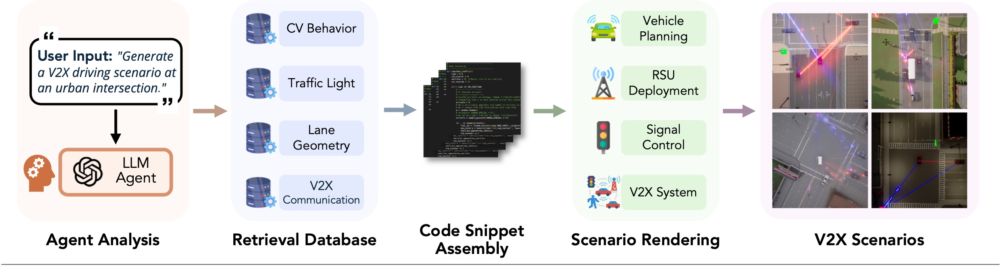

# V2XSynth

**V2XSynth** is an LLM+RAG framework that compiles natural-language intents into **communication-aware** V2X scenarios in **CARLA**, assembling Scenic behavior specs, spatial/map context, and empirical SPaT/MAP/BSM profiles into executable simulations.

🔗 **Project page:** https://keshuw95.github.io/V2XSynth/  
📄 **Preprint:** coming soon

---

## Highlights
- **LLM Agent Analysis.** The Interpreter turns prompts into a structured spec \(S=(V,R,P,E,M)\); the Agent validates with schema+priors, disambiguates intent, and guards against drift before retrieval.
- **Retrieval-Augmented Code Generation.** Behavior/map/V2X stores are queried with constraint checks, then bound into deterministic **Scenic + Python** for CARLA with spatial, behavioral, and communication consistency.
- **Automated V2X Scenario Synthesis.** Infrastructure-aware placement (signal richness + centrality), realistic latency/jitter/loss/decoding, and joint mobility–messaging telemetry that drives closed-loop fault exploration.

---

## Simplified Architecture

<p align="center">
  
</p>

---

## Citation
```bibtex
@article{wu2025v2xsynth,
  title   = {V2XSynth: An LLM-Driven, Retrieval-Augmented Framework for Realistic V2X Scenario Synthesis},
  author  = {Wu, Keshu and Zhang, Hao and Li, Pei and Gan, Rui and You, Junwei and Tu, Zhengzhong and Zhou, Yang},
  journal = {arXiv preprint arXiv:XXXX.XXXXX},
  year    = {2025}
}
